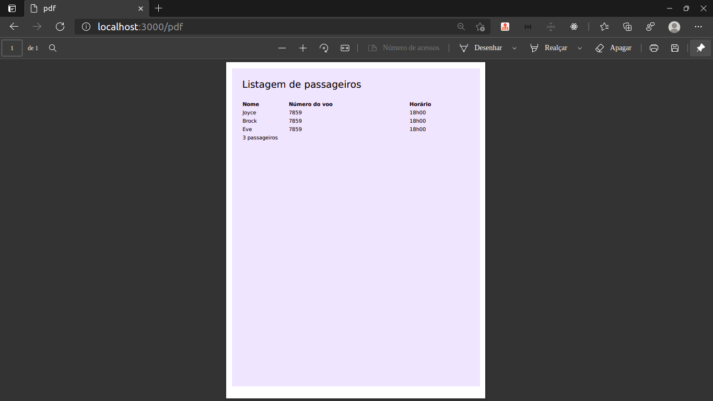

# Gerar PDF com NodeJS, Puppeteer, EJS e TailwindCSS
 
 

 
 

## Projeto

Exemplo de como gerar PDF com nodeJS, puppeteer, EJS e TailwindCSS

## techs
* [ ] NodeJS
  * [ ] Express
  * [ ] EJS - Templat engine que permite inserir codigo JS no HTML
  * [ ] html-pdf

## Resumo Aula Mayk Brito
Aulas disponivél no <a href="https://www.youtube.com/watch?v=AoU7aEdTldE&t=1346s">Youtube</a> sobre gerar pdf.
### O que vamos aprender aqui?
* [ ] NodeJS
* [ ] Criar um servidor com uma rota
* [ ] Usar um template engine
* [ ] Usar callbacks
### Bora codar?
* [ ] Iniciar o projeto com yarn
* [ ] Instalar dependenciasexpress ejs html-pdf
* [ ] Iniciar o servidor
* [ ] Criar uma rota da aplicação
  * [ ] Entender request, response
  * [ ] Primeiro entendimento de callback
  * [ ] Está confuso sobre HTTP? Discover
* [ ] Criar uma lista de dados para criar o relatório
* [ ] Criar um HTML
* [ ] Mostrar na rota (tá curtindo? deixa o like plis)
* [ ] Enviar dados para o HTML (template engine)
* [ ] Segundo entedimento de callback
* [ ] Utilizar o html-pdf e configurar as opções
* [ ] Callback de novo?
* [ ] Gerar o arquivo
### Bônus
* [ ] Melhorar o estilo do PDF
* [ ] Utilizar o puppeteer
* [ ] criar uma nova rota para exportação
* [ ] iniciar o puppeteer (headless)
* [ ] iniciar a página
* [ ] ir para URL (aguardar toda a página ser carregada)
* [ ] configurar e gerar o pdf
* [ ] fechar o browser
* [ ] configurar o tipo de conteúdo da rota como application/pdf
* [ ] exportar o PDF
### Próximos passos
* [ ] Revise seu código e tente lembrar o que cada coisa faz
* [ ] Crie uma nova ideia de exportação de PDF, baseado nesse modelo
* [ ] Comente o que achou :)